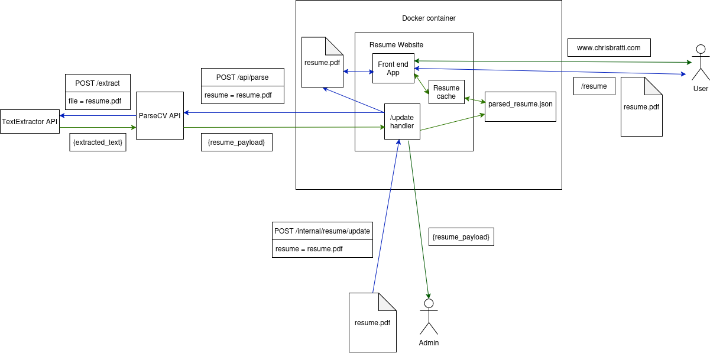

# ChrisBratti.com

A full-stack resume website, written in Rust with the Leptos framework

## ParseCV integration

This app integrates with my [ParseCV](https://github.com/chris-bratti/ParseCV) API to parse PDF resume and populate the front end with the JSON response

The above diagram shows how the resume update process works. For simplicity it doesn't include the approval endpoint.

### Front end process
- On start up, the `parsed_resume.json` file containing the resume's JSON payload is read from and
saved in the `Resume Cache`
- The front-end reads from the `Resume Cache` to populate the page when the page is loaded

### Update process
- Resume is POSTed to the `/update` endpoint
- The PDF is saved in the docker container's file system. Any existing PDF is renamed and backed up
- The PDF is sent to `ParseCV` and is returned as a JSON payload
- The JSON payload is saved as `parsed_resume_pending.json`
- The resume payload is sent back as a response to be reviewed

At this point the new resume is not live until its approved
### Approval process
- Admin hits the `/approve` endpoint
- The `parsed_resume_pending.json` file is moved to `parsed_resume.json`
- The `Resume Cache` is manually updated with the new resume information

The new resume info is now live!

## OAuth integration
This website also serves as an OAuth2 client for my [Auth-Server application](https://github.com/chris-bratti/auth-server) - a centralized authentication layer for my applications