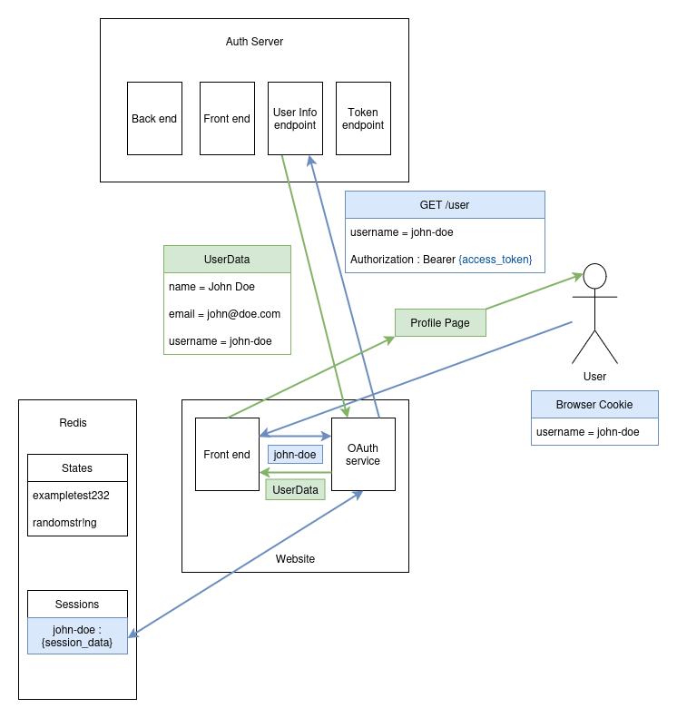

# ChrisBratti.com

A full-stack resume website, written in Rust with the Leptos framework

## ParseCV integration

This app integrates with my [ParseCV](https://github.com/chris-bratti/ParseCV) API to parse PDF resume and populate the front end with the JSON response


The above diagram shows how the resume update process works. For simplicity it doesn't include the approval endpoint.

### Front end process
- On start up, the `parsed_resume.json` file containing the resume's JSON payload is read from and
saved in the `Resume Cache`
- The front-end reads from the `Resume Cache` to populate the page when the page is loaded

### Update process
- Resume is POSTed to the `/update` endpoint
- The PDF is saved in the docker container's file system. Any existing PDF is renamed and backed up
- The PDF is sent to `ParseCV` and is returned as a JSON payload
- The JSON payload is saved as `parsed_resume_pending.json`
- The resume payload is sent back as a response to be reviewed

At this point the new resume is not live until its approved
### Approval process
- Admin hits the `/approve` endpoint
- The `parsed_resume_pending.json` file is moved to `parsed_resume.json`
- The `Resume Cache` is manually updated with the new resume information

The new resume info is now live!

## OAuth integration
This website also serves as an OAuth2 client for my [Auth-Server application](https://github.com/chris-bratti/auth-server) - a centralized authentication layer for my applications

### Pre-requirements

To integrate an application (like this site, referred later to as `website`) with `Auth Server`, it must first be registered. When registering, the application must provide a 
`redirect_url` so `Auth Server` knows where to redirect users after a successful login. Once the application's registration is approved, it is given a `client_id` and a `client_secret`. These credentials
are unique to each application and stored securely.

### Step 1 - Login


- User initiates a login request on the `website` by clicking the login button
- The front end makes a request to the back-end for the URL to direct the user to the `Auth Server` app
- The back end generates a random `state` string and stores it in Redis
- The back end retrieves the website's `client_id` and builds redirect URL in format:
```
login.website.com/login?client_id={client_id}&state={state_string}
```
- The front end redirects the user to the URL the back end provided
- User is now on the `Auth Server` login page

### Step 2 - Authorization code


- User logs into the `Auth Server` with their credentials
- The `Auth Server` back end validates these credentials against it's database
- The `Auth Server` redirects the user back to the `redirect_url` with the following format:
```
website.com/auth?authorization_code={authorization_code}&state={state}
```
- The `website` receives this request and validates the `state` against the Redis cache to ensure its genuine

### Step 3 - Access token


- The `website`'s back end uses the `authorization_code` it was given to make a request to `Auth Server`'s token endpoint
- `Auth Server` validates the `authorization_code` and generates an `access_token` (and other `SessionData`) for the user associated with the `authorization_code`
- The `website` stores this `SessionData` encrypted in Redis so it can be re-used
- The user is logged in and a session cookie is added to their browser so they can be identified

### Step 4 - User Data



- The `website` can now use the `access_token` to make a request to `Auth Server`'s user info endpoint
- `Auth Server` validates the `access_token`, retrieves the user information from its database, and returns it as a JSON payload
- The `website` now has the relevant user info and can present it on the front end as it needs

### Step 5+
- The session cookie in the user's browser can be used to validate them so they don't have to keep logging in
- The `access_token` can be re-used until it expires (10 minutes) to retrieve user info
- The `refresh_token` can be used for 30 days to request a new `access_token`